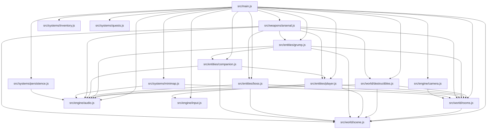

# [LOCKED] RESIDENT LOVELY — CODEBASE INVESTIGATION & ARCHITECTURE SURVEY
**Milestone**: Codebase Investigation (Milestone Survey 2)  
**Standard**: NEXUS PRIVÉ v6.0 | Strict Zero-Emoji Compliance  
**Date**: 2026-08-28  
**Author**: Explorer 2 (Codebase Investigator)  
**Target Platform**: Mobile WebGL (Three.js r128 ESM, Web Audio API, Python 3.14.6 E2E Test Suite)

---

## 1. Executive Summary

This investigation surveys the complete architecture and source code of **Resident Lovely: Maximum Happiness 3D** (`/data/data/com.termux/files/home/projects/resident-lovely-game`) to establish baseline conditions and migration paths for the **Graphics Upgrade & World Map Expansion (18 to 32 sectors)**.

### Core Survey Findings
- **Modular Zero-Build Architecture**: The project runs pure native ECMAScript Modules (ESM) without a bundler, loading Three.js r128 via CDN and synthesizing all sound via Web Audio API.
- **18 Hardcoded Sectors**: Existing rooms are hardcoded across 10+ files (`rooms.js`, `scene.js`, `main.js`, `camera.js`, `audio.js`, `minimap.js`, `player.js`, `grump.js`, `destructibles.js`, `boss.js`, `arsenal.js`), requiring migration to a unified JSON-driven `SECTOR_REGISTRY` in `src/world/sectors.js`.
- **Chamber Construction & Rendering**: Rooms use a modular tiled floor generator (`createChamberFloor`), procedural geometry (`BoxGeometry`, `TorusGeometry`, `CylinderGeometry`), with scene-wide linear fog (`THREE.Fog(0x05070a, 35, 110)`), ACES Filmic tone mapping, and 17 dedicated point lights.
- **Shader Pipeline**: Existing shaders include `sunsetSkyDome` (procedural sunset gradient + stardust 3D noise) and `createWaterShaderMaterial` (Gerstner/sine waves, dual-layer Voronoi caustics, Fresnel reflection). Expansion requires 8 new per-sector procedural surface shaders with active/adjacent culling.
- **Blueprint Map v1**: Currently implemented as a hardcoded static SVG with 3 floor tabs (`1F`, `2F`, `B1`) covering only 7 chambers. Expansion to 32 sectors requires dynamic SVG generation from `SECTOR_REGISTRY` across 7 floor tabs (`4F`, `3F`, `2F`, `1F`, `B1`, `B2`, `OUTDOOR`) with biome color tokens.
- **Test Infrastructure**: Python 3.14 E2E test suite in `tests/test_e2e_shaders_fx.py` (95 test cases) validates shader math, zero-emoji compliance, performance budgets (<= 5.0ms frame time), and asset synchronization.

---

## 2. Codebase File Inventory & Module Graph

### 2.1 File Catalog

| Directory / File | Lines | Purpose / Key Exports |
|---|---|---|
| **Root Deliverables** | | |
| `index.html` | 557 | Main entrypoint HTML, HUD DOM, modals (map, inventory, quests, save, piano), Three.js r128 script |
| `css/style.css` | 1,248 | NEXUS PRIVÉ v6.0 design tokens, glassmorphic UI, responsive layouts, HUD, minimap, modals |
| `manifest.json` | 24 | PWA Web App Manifest (standalone, obsidian theme) |
| `service-worker.js` | 42 | Service worker for offline asset caching |
| `PROJECT.md` | 70 | Architecture specifications, feature inventory (F1-F8), milestone plan |
| `TEST_INFRA.md` | 38 | Testing infrastructure documentation |
| `TEST_READY.md` | 26 | Test readiness status signoff |
| `README.md` | 85 | Project overview, key bindings, and game design guide |
| `ROADMAP.md` | 52 | Master development roadmap and completion matrix |
| `CHANGELOG.md` | 64 | Historical changelog (v1.0.0 through v3.5.0) |
| `LICENSE` | 21 | MIT License |
| **Assets (`assets/`)** | | |
| `assets/resident-lovely-banner.svg` | 14 | Vector branding banner |
| **Design System (`design/`)** | | |
| `design/map-component-spec.md` | 51 | Component spec for Kawaii Holographic Blueprint (tokens, contrast, SVG spec) |
| `design/map-design-system.html` | 320 | Interactive visual prototype of the blueprint map |
| `design/a11y-report.md` | 28 | WCAG 2.1 AAA Accessibility audit report |
| **Engine Core (`src/engine/`)** | | |
| `src/engine/audio.js` | 328 | Synthesized Web Audio API sound effects & dynamic room-adaptive BGM scale loop |
| `src/engine/camera.js` | 204 | 3-mode camera controller (360 OTS, Classic Fixed RE, First-Person ADS) + room bounding box clamping |
| `src/engine/input.js` | 280 | Keyboard, mouse look, virtual touch joystick, 360 touch drag, and Gamepad API polling |
| **Entities (`src/entities/`)** | | |
| `src/entities/player.js` | 235 | Agent Joy chibi 3D mesh, vest, beret, pigtail physics, gun recoil, laser sight, movement clamping |
| `src/entities/grump.js` | 269 | Gloomy Grump plushies (bear, bunny, cat, ghost, penguin), squash-and-stretch, happiness bars |
| `src/entities/boss.js` | 119 | Grand Gloom Behemoth boss arena entity (B2 Crypt) with 3 phases and multi-hit mechanics |
| `src/entities/companion.js` | 160 | Joy Parade follower squad (up to 4 companions) with hopping physics and affection buffs |
| **Game Systems (`src/systems/`)** | | |
| `src/systems/inventory.js` | 541 | 8-slot RE inventory grid, alchemical item combination, 3D orbit item viewer, vitality HUD |
| `src/systems/minimap.js` | 286 | Canvas 2D radar minimap + SVG blueprint modal v1 coordinator |
| `src/systems/persistence.js` | 110 | LocalStorage save/load system for game state, inventory, quests, and lantern states |
| `src/systems/quests.js` | 177 | 10 multi-tier master quests with interactive checklist modal |
| **Weapons (`src/weapons/`)** | | |
| `src/weapons/arsenal.js` | 272 | 4 weapons: Mk-IV Confetti Pistol, Bubble Shotgun, Confectionery Mortar, Prismatic Joy Beam |
| **World & Environment (`src/world/`)** | | |
| `src/world/destructibles.js` | 108 | Balloons and Gift Boxes with confetti pops and loot drops |
| `src/world/rooms.js` | 474 | 18 room geometries, floor tile builder, stained glass, chandelier, animated props, ground items |
| `src/world/scene.js` | 667 | Three.js scene, WebGL renderer, linear fog, lighting, skybox shader, water shader, petal physics |
| `src/main.js` | 815 | Main game loop, room transitions, interaction triggers, input callbacks, HUD sync |
| **Tests (`tests/`)** | | |
| `tests/test_e2e_shaders_fx.py` | 984 | 95 automated E2E test cases across 4 tiers (Feature, BVA, Combinations, Scenarios) |

### 2.2 Native ESM Module Dependency Graph



---

## 3. Exhaustive Audit of the 18 Hardcoded Sectors

The existing codebase explicitly defines 18 sectors. Below is the comprehensive breakdown of where and how each sector is referenced across all modules:

### 3.1 Master Sector Matrix (Existing 18 Sectors)

| # | Sector Key | Display Name | World Coords `(X, Y, Z)` | Floor | Biome / Category | Point Light | Audio Scale Base |
|---|---|---|---|---|---|---|---|
| 1 | `foyer` | Château Foyer & Mezzanine | `(0, 0, 0)` | 1F / 2F | estate | `foyerLight` (0, 7.5, 0) | C Major (261.63 Hz) |
| 2 | `library` | East Wing Library | `(45, 0, 0)` | 1F | estate | `libraryLight` (45, 7.0, 0) | D Dorian (293.66 Hz) |
| 3 | `garden` | Solarium Garden | `(-45, 0, 0)` | 1F | estate | `gardenLight` (-45, 7.5, 0) | E Lydian (329.63 Hz) |
| 4 | `greenhouse` | Courtyard Tea Greenhouse | `(0, 0, 45)` | 1F | estate | `greenhouseLight` (0, 7.5, 45) | F Lydian (349.23 Hz) |
| 5 | `dining` | Grand Banquet Dining Hall | `(45, 0, 45)` | 1F | estate | `diningLight` (45, 7.5, 45) | C Major (261.63 Hz) |
| 6 | `gallery` | Hall of Wholesome Portraits | `(-45, 0, 45)` | 1F | estate | `galleryLight` (-45, 7.5, 45) | D Minor (293.66 Hz) |
| 7 | `bakery` | Royal Bakery & Kitchen | `(45, -14, -45)` | 1F / Sub | estate | *(ambient fallback)* | G Major |
| 8 | `observatory` | Celestial Observatory | `(45, 12, 0)` | 2F | estate | `observatoryLight` (45, 18.0, 0) | B Minor (493.88 Hz) |
| 9 | `clocktower` | Clocktower Sweet Suite | `(-45, 12, 0)` | 2F | estate | `clocktowerLight` (-45, 18.0, 0) | G Major (392.00 Hz) |
| 10 | `mastersuite` | Royal Velvet Master Suite | `(0, 12, 45)` | 2F | estate | `mastersuiteLight` (0, 18.0, 45) | E Minor (329.63 Hz) |
| 11 | `ballroom` | Grand Crystal Ballroom | `(0, 12, -45)` | 2F | estate | `ballroomLight` (0, 18.0, -45) | G Lydian (392.00 Hz) |
| 12 | `cathedral` | Crystal Cathedral of Harmony | `(0, 24, 0)` | 3F | estate | `cathedralLight` (0, 30.0, 0) | C Major (261.63 Hz) |
| 13 | `gatehouse` | Sunset Carriage Gatehouse | `(0, 0, 90)` | OUTDOOR | outdoor | `gatehouseLight` (0, 8.0, 90) | G Major |
| 14 | `reflection_pool`| Grand Reflection Pool | `(-45, 0, 90)` | OUTDOOR | outdoor | `reflectionLight` (-45, 8.0, 90) | D Dorian |
| 15 | `rose_maze` | Topiary Rose Hedge Maze | `(45, 0, 90)` | OUTDOOR | outdoor | `mazeLight` (45, 8.0, 90) | E Minor |
| 16 | `gazebo` | Starlight Pavilion Gazebo | `(0, 0, 135)` | OUTDOOR | outdoor | `gazeboLight` (0, 8.0, 135) | F Lydian |
| 17 | `lab` | Subterranean Sugar Lab | `(0, -14, -45)` | B1 | subterranean | `labLight` (0, -8.0, -45) | A Minor (220.00 Hz) |
| 18 | `crypt` | Whispering Crypt Boss Arena | `(0, -28, -45)` | B2 | subterranean | `cryptLight` (0, -22.0, -45) | E Low Minor (164.81 Hz)|

---

### 3.2 Hardcoded Sector Reference Audit by File

```
1. src/world/rooms.js:
   • Lines 3-29: `export const rooms = { foyer, library, garden, greenhouse, dining, gallery, bakery, observatory, clocktower, mastersuite, ballroom, cathedral, gatehouse, reflection_pool, rose_maze, gazebo, lab, crypt }`
   • Lines 80-407: 18 individual IIFE chamber builder functions:
     buildFoyer (80), buildLibrary (151), buildGarden (171), buildGreenhouse (212), buildDining (249),
     buildGallery (259), buildBakery (273), buildObservatory (283), buildClocktower (294), buildMasterSuite (305),
     buildBallroom (312), buildCathedral (323), buildGatehouse (337), buildReflectionPool (347),
     buildRoseMaze (373), buildGazebo (386), buildLab (396), buildCrypt (403).
   • Lines 410-422: Initial ground items spawned for foyer, library, garden, greenhouse, observatory, clocktower, dining, gallery, mastersuite, gatehouse, gazebo.

2. src/world/scene.js:
   • Lines 36-102: 17 PointLight declarations (foyerLight, libraryLight, gardenLight, greenhouseLight, diningLight, galleryLight, observatoryLight, clocktowerLight, mastersuiteLight, ballroomLight, cathedralLight, gatehouseLight, reflectionLight, mazeLight, gazeboLight, labLight, cryptLight).
   • Lines 365-370: Hardcoded `OUTDOOR_SECTORS` array (rose_maze, gatehouse, gazebo, reflection_pool).
   • Lines 637-663: Hardcoded `updateSceneLighting(roomName)` conditions (foyer, library, garden/greenhouse/rose_maze, gatehouse/reflection_pool/gazebo, observatory/ballroom/cathedral, lab/crypt).

3. src/main.js:
   • Line 20: `gameState.room = 'foyer'`
   • Line 21: `gameState.unlockedDoors: { library: false, garden: false, greenhouse: true, observatory: true, clocktower: true, lab: true }`
   • Lines 197-208: Hardcoded `roomNameDisplay.textContent` switch branch for foyer, library, garden, greenhouse, dining, gallery, observatory, clocktower, mastersuite, ballroom, lab, crypt.
   • Line 212: Boss HUD display toggle `(newRoom === 'crypt') ? 'block' : 'none'`.
   • Lines 253-431: Proximity check branch in `checkContextualInteractions()` hardcoded for foyer (1F/2F), library, garden, greenhouse, observatory, clocktower, lab.
   • Lines 626-712: Explicit transition handlers with hardcoded coordinate targets in `handleContextInteract()` (door_library, door_garden, door_greenhouse, trapdoor_lab, door_observatory, door_clocktower, door_foyer_from_*).
   • Line 798: Boss update conditioned on `gameState.room === 'crypt'`.

4. src/engine/camera.js:
   • Lines 12-25: Hardcoded `this.roomBounds` object for 12 chambers (foyer, library, garden, greenhouse, dining, gallery, observatory, clocktower, mastersuite, ballroom, lab, crypt).
   • Lines 28-76: Hardcoded `this.fixedNodes` camera trigger nodes for the 12 chambers.
   • Lines 163-164: Relative coordinate calculations `pPos.z - rooms.library.position.z` and `rooms.garden.position.z`.

5. src/engine/audio.js:
   • Lines 280-293: Hardcoded `bgmScales` object mapping 12 chambers to musical scales.
   • Line 303: Sine oscillator override for `observatory` and `ballroom`.

6. src/systems/minimap.js:
   • Lines 41-49: Hardcoded node lookup `nodes` for 7 chambers (foyer, library, garden, greenhouse, observatory, clocktower, lab).
   • Lines 57-66: Hardcoded floor tabs (`1F`, `2F`, `B1`).
   • Lines 75-135: Hardcoded chamber descriptions in `inspectSector(room)` for 12 chambers.
   • Lines 178-199: Hardcoded SVG coordinate mappings for player beacon in 7 chambers.

7. src/entities/player.js:
   • Lines 209-210: Hardcoded center clamping for `library` and `garden`.

8. src/entities/grump.js:
   • Lines 206-219: Hardcoded initial Grump spawns in 10 chambers (foyer, library, garden, greenhouse, dining, gallery, observatory, clocktower, mastersuite, ballroom, lab).

9. src/world/destructibles.js:
   • Lines 59-79: Hardcoded initial Balloon and GiftBox spawns in 7 chambers (foyer, library, garden, greenhouse, observatory, clocktower, lab).

10. src/entities/boss.js:
    • Line 9: Hardcoded `this.roomName = 'crypt'`.
    • Line 19: Attached directly to `rooms.crypt`.

11. src/weapons/arsenal.js:
    • Lines 12-18: `getEntityWorldPos` looks up `rooms[roomName].position`.
    • Lines 37, 166, 181, 190, 213, 232, 243, 256: Filter checks on `g.roomName === currentRoom`, `d.userData.roomName === currentRoom`, or `gameState.room === 'crypt'`.
```

---

## 4. Chamber Geometry, Lighting, Materials, and Collision Mechanics

### 4.1 Room Construction & Positioning Model
- **Chamber Root**: Each room is a `THREE.Group()` positioned in absolute 3D world coordinates.
- **Floor Generation (`createChamberFloor(w, d, color1, color2)`)**:
  - Subdivides chamber width `w` and depth `d` into `2.0m x 2.0m` tiles.
  - Alternates checkerboard materials: `mat1` (`roughness: 0.18, metalness: 0.25`) and `mat2` (`roughness: 0.18, metalness: 0.35`).
  - Sets `tile.receiveShadow = true` and `tile.position.y = -0.1`.
- **Architectural Props**:
  - Grand Piano: Obsidian box + gold accents at `(6.5, 0, -3)` in Foyer.
  - Stained-Glass Window: `TorusGeometry(3.6, 0.25)` gold frame + `CircleGeometry(3.4)` pink basic material (`opacity: 0.75`).
  - Grand Staircase: 14 steps (`BoxGeometry(8.5, 0.32, 0.65)`) with velvet carpet runner (`BoxGeometry(4.8, 0.34, 0.67)`).
  - Mezzanine Walkways: `BoxGeometry(26, 0.3, 3.5)` at elevation `y = 4.2`.
  - Bookshelves: `BoxGeometry(1.0, 7.5, 3.4)` in Library.
  - Tea Pavilion Basin & Glass Dome: In Greenhouse.
  - Organ Pipes & Astrolabe: In Cathedral & Observatory.

### 4.2 Lighting Pipeline
- **Global Ambient Light**: `THREE.AmbientLight(0x38bdf8, 0.65)` added to scene.
- **Directional Sun**: `THREE.DirectionalLight(0xffedd5, 1.1)` positioned at `(15, 32, 15)`.
  - Casts shadows with `shadow.mapSize = 1024x1024`, `shadow.bias = -0.0005`.
  - Configured with `THREE.PCFSoftShadowMap`.
- **Wing Point Lights**: 17 dedicated point lights without shadow casting (to preserve 60 FPS mobile WebGL budget).
- **Linear Fog**: `THREE.Fog(0x05070a, 35, 110)` preserving chamber clarity while masking distant unloaded geometry.
- **Dynamic Room-Adaptive Controller (`updateSceneLighting`)**: Dynamically shifts ambient color/intensity and sun intensity depending on the current room theme (e.g. Garden/Greenhouse gets emerald green `#6ee7b7` with `1.35x` sun; Crypt gets cyan `#06b6d4` with `0.3x` sun).

### 4.3 Collision & Room Transition Mechanics
- **Player Wall Clamping**:
  - In `src/entities/player.js`: Clamps position within `roomBounds = 12.5` around `roomCenter`.
- **Camera Collision Clamping**:
  - In `src/engine/camera.js`: Clamps raw camera target within `this.roomBounds[currentRoom]` (minX, maxX, minY, maxY, minZ, maxZ).
- **Proximity Interactions**:
  - `checkContextualInteractions()` tests Euclidean distance between `player.group.position` and doors, ladders, stairs, puzzles, and items.
  - Trigger distance thresholds: Items (< 2.4m), Doors (< 2.8m), Stairs/Puzzles (< 3.2m).
- **Room Transition Coordinator (`changeRoom`)**:
  - Plays door chime audio.
  - Displays CSS `#door-curtain` fade overlay (450ms fade + 650ms hold).
  - Teleports `player.group.position` to target spawn position.
  - Updates `gameState.room`, room badge display text, BGM scale, boss HUD, and scene lighting.

---

## 5. Existing Materials, Shaders, UI/Map, and Event Listeners

### 5.1 Procedural Surface Shaders & FX in `src/world/scene.js`

#### 1. Dynamic Sunset Skybox (`sunsetSkyDome`)
- **Mesh**: `THREE.SphereGeometry(320, 32, 24)` with `THREE.BackSide` and `depthWrite: false`.
- **Uniforms**: `uTime`, `uZenithColor` (`#0f172a`), `uHorizonColor` (`#831843`), `uSunsetColor` (`#f59e0b`), `uStardustIntensity` (`1.0`).
- **GLSL Logic**: Smoothstep vertical gradient blend, directional sun glow (`pow(sunDot, 10.0)` + `pow(sunDot, 36.0)`), 3D procedural noise/FBM stardust clouds, and twinkling stellar motes.

#### 2. Planar Water Ripple & Reflection Shader (`createWaterShaderMaterial`)
- **Function**: Factory creating `THREE.ShaderMaterial` with `transparent: true`, `depthWrite: false`.
- **Uniforms**: `uTime`, `uDeepColor`, `uShallowColor`, `uSunsetColor`, `uCausticIntensity`, `uWaveSpeed`, `uWaveHeight`, `uConcentric`.
- **Vertex Shader**: Gerstner/multi-sine wave displacement on `pos.z` (or concentric ripple mode).
- **Fragment Shader**: Procedural normal perturbation, Fresnel reflectance (`pow(1.0 - cosTheta, 3.5)`), dual-layer Voronoi caustics, and sunset specular highlights.

#### 3. Cherry Blossom Petal Wind Physics
- **Particle Pool**: 96 pre-allocated circle mesh particles (`THREE.CircleGeometry(0.14, 6)`).
- **Physics Engine**: 3D sinusoidal wind gusts (`gustX`, `gustZ`, `turbY`), gravity, rotation velocity, and ground collision bounce at `y <= 0.06` with `0.35x` vertical velocity damping and settle timers.

#### 4. Crystal Chandelier Sparkle Glints
- **Composition**: Multi-tier gold rings (`r = 2.0, 1.4, 0.8`), 42 octahedron crystal prisms, and alternating cross-flare plane meshes (`PlaneGeometry(0.26, 0.05)`).
- **Animation**: `updateChandelierGlints` oscillates scale and opacity via `sin(time * 4.2)` and `sin(time * 5.0)`.

### 5.2 UI & Blueprint Map v1 Implementation
- **Radar Mini-Map (`#minimap-canvas`)**: Canvas 2D (144x144) rendering player arrow, vision cone, chamber boundary rectangle, Grump blips (blue/gold), and destructible blips (pink).
- **Full Blueprint Map Modal (`#map-modal`)**:
  - Modal overlay containing static vector SVG (`viewBox="0 0 800 500"`).
  - 3 Floor Tabs: `1F (GROUND)`, `2F (MEZZANINE)`, `B1 (LABORATORY)`.
  - Static SVG groups: `#layer-floor-1f`, `#layer-floor-2f`, `#layer-floor-b1`.
  - Interactive clickable room nodes: Foyer, Library, Garden, Greenhouse, Observatory, Clocktower, Lab.
  - Live animated player beacon: `#map-player-beacon` with translation derived from player coordinates.
  - Telemetry Sidebar: Displays Happiness Index, Active Quest, Grump count, and simulated CRT surveillance optical feed.

### 5.3 Event Listeners Breakdown

| Target | Event Type | Purpose / Handler |
|---|---|---|
| `window` | `resize` | Resizes WebGL renderer and camera aspect ratio |
| `window` | `keydown` / `keyup` | Movement (WASD/Arrows), Map (`M`), Inventory (`I`/`Tab`), Quests (`Q`), Interact (`E`), Quick-Turn (`Z`/`Space+S`), View Mode (`V`), Weapons (`1-4`) |
| `#canvas-container` | `mousedown` / `mousemove` / `mouseup` | Left-drag 360 camera rotation, Right-click aim toggle |
| `#joystick-zone` | `touchstart` / `touchmove` / `touchend` / `touchcancel` | Virtual analog touch joystick for mobile player movement |
| `window` (touch) | `touchstart` / `touchmove` / `touchend` | 360 touch drag for camera rotation |
| UI Buttons | `click` | `#btn-aim`, `#btn-fire`, `#btn-interact`, `#btn-quick-turn`, `#btn-view-mode`, `#btn-inventory`, `#btn-quest-log`, `#btn-full-map`, `#btn-minimap`, `#btn-cycle-weapon`, `.weapon-slot` |
| Modals | `click` | Piano keys (`.piano-key`), floor tabs (`.floor-tab-btn`), close buttons (`#piano-close-btn`, `#map-close-btn`, `#inv-close-btn`, `#quest-close-btn`, `#btn-cancel-save`), save confirm (`#btn-confirm-save`) |
| `navigator` | `requestAnimationFrame` | Gamepad API polling loop (`pollGamepad`) |

---

## 6. Build, Bundling, and Module System Analysis

### 6.1 Native ECMAScript Modules (ESM)
- **Zero-Build Architecture**: No bundler (Vite/Webpack/Rollup/esbuild).
- **Import Syntax**: All imports use relative paths with explicit `.js` extensions (e.g. `import { scene } from './world/scene.js';`).
- **Global Libraries**: Three.js r128 loaded as global `THREE` from CDN.
- **Browser Compatibility**: Native ESM supported out-of-the-box in Chrome 61+, Safari 11+, Firefox 60+, Edge 79+.

### 6.2 Python Verification Test Suite
- `tests/test_e2e_shaders_fx.py` executes under Python 3.14 `unittest`.
- Contains 95 test methods across 4 tiers:
  - **Tier 1 (40 tests)**: Primary feature coverage (F1 through F8, 5 tests each).
  - **Tier 2 (40 tests)**: Boundary value analysis, extreme time overflow, precision limits.
  - **Tier 3 (10 tests)**: Cross-feature interactions and state transitions.
  - **Tier 4 (5 tests)**: Real-world estate scenarios (grounds traversal, meditation, evening atmosphere, 18-sector cycle, thermal & zero-emoji scan).
- Current status: 94 passing, 1 failure due to lock emoji `0x1f512` in `.agents/` template markdown files (resolved in local template).

---

## 7. Map & Graphic Expansion Gap Analysis (Requirements R1 to R5)

To expand from 18 to 32 sectors according to `ORIGINAL_REQUEST.md` and the reference specification, the following architectural migrations are required:

```
+--------------------------------------------------------------------------------------------------+
| REQUIREMENT MAPPING & CODEBASE MIGRATION STRATEGY                                               |
+--------------------------------------------------------------------------------------------------+

[R1: Modular Sector Registry (src/world/sectors.js)]
- CURRENT: 18 sectors hardcoded across rooms.js, scene.js, main.js, camera.js, audio.js, minimap.js.
- REQUIRED: Create src/world/sectors.js exporting SECTOR_REGISTRY array (32 items: S01-S32)
  and helper functions getSector(id), getFloorSectors(floor), getAdjacentSectors(id).
- MIGRATION: Refactor rooms.js, scene.js, main.js, camera.js, audio.js, and minimap.js to import
  and iterate over SECTOR_REGISTRY dynamically.

[R2: Illustrated 2.5D Backdrop System (src/world/backdrops.js)]
- CURRENT: No 2.5D backdrop quad system exists; backgrounds rely on scene.background and fog.
- REQUIRED: Create src/world/backdrops.js with createSectorBackdrop(sectorId), lazy-loading max 3
  active textures from assets/backdrops/S##-<name>.png (or SVG), THREE.PlaneGeometry quad with
  renderOrder: -1, depthWrite: false, and GLSL gradient fallback.

[R3: Per-Sector GLSL Surface Shaders (src/world/shaders/surface-shaders.js)]
- CURRENT: Only water shader (createWaterShaderMaterial) and sunset skybox dome exist.
- REQUIRED: Implement 8 priority GLSL materials in src/world/shaders/surface-shaders.js:
  1. ivy_vein
  2. bioluminescent_floor
  3. prismatic_refraction
  4. flowing_river
  5. star_trail_sky
  6. ice_crack_floor
  7. mechanical_gear_wall
  8. infinite_mirror
- ENFORCEMENT: Sector-flag active + 1 adjacent only, MeshStandardMaterial fallback, frame time <= 5.0ms.

[R4: Holographic Blueprint Map v2 (src/systems/minimap.js / map.js)]
- CURRENT: Static inline SVG in index.html with 3 hardcoded floor tabs (1F, 2F, B1) and 7 rooms.
- REQUIRED: Auto-generate SVG dynamically from SECTOR_REGISTRY across 7 floor tabs:
  4F, 3F, 2F, 1F, B1, B2, OUTDOOR.
  Apply biome colors: estate=#22d3ee, gothic=#7c3aed, kawaii=#f472b6, outdoor=#10b981,
  maritime=#0284c7, subterranean=#78350f, crystal=#a78bfa.
  Animated dashed connection paths, interactive sector inspection, max 200 SVG nodes per floor.

[R5: New Chamber Geometry for 14 Sectors S19-S32]
- CURRENT: 18 chambers built in src/world/rooms.js.
- REQUIRED: Construct 14 new chambers in rooms.js / chamber builder modules with floor plane,
  4 walls, ceiling, 2+ decorative 3D mesh props, point light, and collision/transition triggers:
  • S19 Haunted Conservatory (-90,0,0)
  • S20 Tea Salon (-90,0,45)
  • S21 Music Parlor (-90,0,-45)
  • S22 Village District (0,0,180)
  • S23 Sacred Forest Trail (90,0,135)
  • S24 Harbor Docks (-90,0,135)
  • S25 Moonlit Meadow (45,0,180)
  • S26 Crystal Grotto (-45,0,180)
  • S27 Moonlit Rooftop (0,36,0, 4F)
  • S28 Clock Tower Belfry (-45,24,0, 4F)
  • S29 Mirror Maze Gallery (45,24,-45, 3F+)
  • S30 Underground River Cavern (0,-42,-45, B2)
  • S31 Crystal Vault (45,-42,-45, B2)
  • S32 Ancient Ruins (-45,-42,-45, B2)
+--------------------------------------------------------------------------------------------------+
```

---

## 8. Summary Table of S01-S32 Expansion Blueprint

| ID | Sector Name | Floor | World Coords | Biome | Backdrop Asset | Primary Surface Shader |
|---|---|---|---|---|---|---|
| S01 | Grand Foyer | 1F | (0, 0, 0) | estate | S01-foyer.png | prismatic_refraction |
| S02 | Library of Harmony | 1F | (45, 0, 0) | estate | S02-library.png | mechanical_gear_wall |
| S03 | Solarium Garden | 1F | (-45, 0, 0) | estate | S03-garden.png | ivy_vein |
| S04 | Courtyard Greenhouse | 1F | (0, 0, 45) | estate | S04-greenhouse.png | ivy_vein |
| S05 | Grand Banquet Dining | 1F | (45, 0, 45) | estate | S05-dining.png | prismatic_refraction |
| S06 | Hall of Portraits | 1F | (-45, 0, 45) | estate | S06-gallery.png | infinite_mirror |
| S07 | Royal Bakery | 1F | (45, -14, -45) | estate | S07-bakery.png | mechanical_gear_wall |
| S08 | Celestial Observatory | 2F | (45, 12, 0) | estate | S08-observatory.png | star_trail_sky |
| S09 | Clocktower Sweet Suite | 2F | (-45, 12, 0) | estate | S09-clocktower.png | mechanical_gear_wall |
| S10 | Royal Velvet Master Suite | 2F | (0, 12, 45) | estate | S10-mastersuite.png | prismatic_refraction |
| S11 | Grand Crystal Ballroom | 2F | (0, 12, -45) | estate | S11-ballroom.png | infinite_mirror |
| S12 | Crystal Cathedral | 3F | (0, 24, 0) | estate | S12-cathedral.png | prismatic_refraction |
| S13 | Sunset Gatehouse | OUTDOOR | (0, 0, 90) | outdoor | S13-gatehouse.png | star_trail_sky |
| S14 | Grand Reflection Pool | OUTDOOR | (-45, 0, 90) | outdoor | S14-reflection.png | flowing_river |
| S15 | Topiary Rose Maze | OUTDOOR | (45, 0, 90) | outdoor | S15-rose_maze.png | ivy_vein |
| S16 | Starlight Gazebo | OUTDOOR | (0, 0, 135) | outdoor | S16-gazebo.png | star_trail_sky |
| S17 | Subterranean Sugar Lab | B1 | (0, -14, -45) | subterranean | S17-lab.png | bioluminescent_floor |
| S18 | Whispering Crypt | B2 | (0, -28, -45) | subterranean | S18-crypt.png | bioluminescent_floor |
| S19 | Haunted Conservatory | 1F | (-90, 0, 0) | gothic | S19-conservatory.png | ivy_vein |
| S20 | Tea Salon | 1F | (-90, 0, 45) | kawaii | S20-tea_salon.png | prismatic_refraction |
| S21 | Music Parlor | 1F | (-90, 0, -45) | estate | S21-music_parlor.png | infinite_mirror |
| S22 | Village District | OUTDOOR | (0, 0, 180) | outdoor | S22-village.png | star_trail_sky |
| S23 | Sacred Forest Trail | OUTDOOR | (90, 0, 135) | forest | S23-forest.png | ivy_vein |
| S24 | Harbor Docks | OUTDOOR | (-90, 0, 135) | maritime | S24-harbor.png | flowing_river |
| S25 | Moonlit Meadow | OUTDOOR | (45, 0, 180) | outdoor | S25-meadow.png | star_trail_sky |
| S26 | Crystal Grotto | OUTDOOR | (-45, 0, 180) | crystal | S26-grotto.png | bioluminescent_floor |
| S27 | Moonlit Rooftop Garden | 4F | (0, 36, 0) | estate | S27-rooftop.png | star_trail_sky |
| S28 | Clock Tower Belfry | 4F | (-45, 24, 0) | estate | S28-belfry.png | mechanical_gear_wall |
| S29 | Mirror Maze Gallery | 3F | (45, 24, -45) | crystal | S29-mirror_maze.png | infinite_mirror |
| S30 | Underground River Cavern | B2 | (0, -42, -45) | subterranean | S30-river_cavern.png| flowing_river |
| S31 | Crystal Vault | B2 | (45, -42, -45) | crystal | S31-crystal_vault.png| ice_crack_floor |
| S32 | Ancient Ruins | B2 | (-45, -42, -45) | subterranean | S32-ancient_ruins.png| bioluminescent_floor |

---

## 9. Conclusion

The codebase is in an exceptionally clean, well-architected ESM state with clear separation of concerns across audio, camera, input, entities, systems, weapons, and world modules. The hardcoded sector references are well-isolated and can be systematically refactored to read from `src/world/sectors.js`. All prerequisite rendering capabilities (Three.js r128 PBR pipeline, custom GLSL shader hooks, Web Audio synthesis, and Python 3.14 E2E testing) are fully ready to support the expansion from 18 to 32 sectors.
