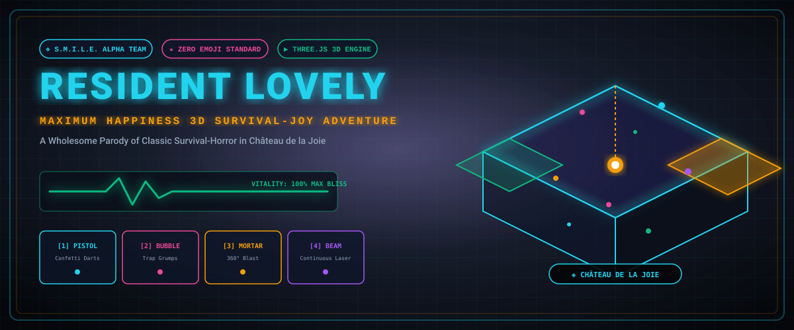

# RESIDENT LOVELY ❖ Maximum Happiness 3D

<p align="center">
  
</p>

<p align="center">
  <a href="https://pierreg99.github.io/resident-lovely-game/"></a>
  <a href="LICENSE"></a>
  <a href="ROADMAP.md"></a>
  <a href="CHANGELOG.md"></a>
  <a href="#"></a>
</p>

> **Resident Lovely** is an over-the-shoulder 3D action-adventure survival-joy game parodying classic survival-horror mechanics (specifically the *Resident Evil* franchise) inverted into an uncompromising aesthetic of **Maximum Happiness and Wholesomeness**.

---

## ❖ Live Web Game Access

- **Public GitHub Pages (Play in Browser)**: [https://pierreg99.github.io/resident-lovely-game/](https://pierreg99.github.io/resident-lovely-game/)
- **Local Control Center Endpoint**: `http://localhost:8080/resident-lovely/index.html`

---

## ❖ Overview & Narrative

Instead of bio-weapons, dark hallways, and gore:
- **Location**: *Château de la Joie* — A grand baroque mansion filled with gold chandeliers, velvet runners, and secret confectionery chambers.
- **Protagonist**: *Agent Joy (S.M.I.L.E. Alpha Team)* armed with an arsenal of wholesome 3D joy weapons.
- **The Threat**: *The Gloom Outbreak* — Friendly plushies turned into sad, moping "Grumps".
- **The Mission**: Explore the mansion wings, solve piano and alchemical puzzles, blast Grumps with overwhelming happiness, and trigger the Grand Friendship Party!

---

## ★ Key Features

### 1. High-Quality 4-Weapon Wholesome Arsenal
- **Mk-IV Confetti Pistol (`[1]`)**: High-velocity precision sparkly darts with rapid single-fire.
- **Pastry Bubble Shotgun (`[2]`)**: 5-projectile bubble spread that traps Grumps in giant floating buoyant bubbles!
- **Confectionery Mortar (`[3]`)**: Heavy ballistic gravity arc exploding in a massive 360-degree confetti shockwave with screen recoil shake.
- **Prismatic Joy Beam (`[4]`)**: Continuous neon rainbow laser beam with real-time cylinder mesh & polyphonic synth audio hum.

### 2. Tactical Radar Mini-Map & Estate Blueprint
- **Circular Radar Mini-Map**: Real-time 360-degree radar scan, room bounds, player orientation cone, Grump blips (Blue = Gloomy, Gold = Dancing), and item pins.
- **Fullscreen Architectural Blueprint (`[MAP]` / Key `M`)**: Interactive floorplan of Château de la Joie with door lock status (Red [LOCK] / Emerald [OPEN]) and player pinpoint coordinates.

### 3. Classic 8-Slot Inventory System (Resident Evil Parody)
- **Joy Vitality ECG**: Real-time heartbeat monitor graph (`MAX BLISS` ➔ `CHEERFUL` ➔ `GRUMPY`).
- **Combine System**:
  - *Sparkle Herb (Green)* + *Sweet Powder (Red)* ➔ *Mega Bliss Cupcake*
  - *Silver Foyer Key* + *Golden Ribbon* ➔ *Master Ballroom Key*
- **Save Points**: Golden Gramophone Music Boxes with `localStorage` persistence.

### 4. Multi-Tier Quests & Tasks
- **Quest 1: The Foyer Sonatina** (Play Grand Piano triad `[C-E-G]` to unlock East Wing Key).
- **Quest 2: Alchemical Bliss Brew** (Deposit crafted Mega Bliss Cupcake into Library Cauldron).
- **Quest 3: Solarium Heart Lanterns** (Ignite all 4 Heart Lanterns in the West Wing Garden).
- **Quest 4: Château Joy Brigade** (Uplift all 5 Gloomy Grumps into celebration dancers).

### 5. Environmental Destructibles
- **Floating Balloons**: Bobbing in room corners; shoot to pop with celebratory confetti and item drops.
- **Gilded Gift Boxes**: Procedural gift chests that fracture into pieces when blasted.

---

## ◈ Controls

### Mobile Touch Controls
- **Left Thumb**: Dynamic floating virtual analog joystick (360-degree movement).
- **Right Thumb**: Swipe screen to orbit camera; dedicated tactile action buttons for `[AIM]`, `[JOY BLAST]`, `[EXAMINE]`, `[GUN]`, `[ITEMS]`, `[TASKS]`, and `[MAP]`.

### Desktop Controls
- **Movement**: `W`, `A`, `S`, `D` or Arrow Keys
- **Aim / Fire**: Right-Click to Aim, Left-Click / `Space` to Fire
- **Weapon Slots**: `1` (Pistol), `2` (Shotgun), `3` (Mortar), `4` (Joy Beam)
- **Cycle Weapon**: Tap `[GUN]` button or cycle numbers
- **Interact / Examine**: `E`
- **Inventory**: `I` or `Tab`
- **Quest Log**: `Q`
- **Tactical Map**: `M`

---

## ❖ Development Progress & Roadmap

| Feature / Milestone | Target Version | Status | Progress |
|---|---|---|---|
| **Core 3D WebGL Engine & Controls** | v1.0.0 | COMPLETED | `[██████████] 100%` |
| **8-Slot Inventory Grid & Combining** | v1.0.0 | COMPLETED | `[██████████] 100%` |
| **Procedural Web Audio SFX Synth** | v1.0.0 | COMPLETED | `[██████████] 100%` |
| **Multi-Tier Quest & Task Engine** | v1.1.0 | COMPLETED | `[██████████] 100%` |
| **Grand Piano Harmonic Triad Puzzle** | v1.1.0 | COMPLETED | `[██████████] 100%` |
| **4-Weapon Arsenal & 3D Ballistics** | v1.2.0 | COMPLETED | `[██████████] 100%` |
| **Tactical Radar Mini-Map & Blueprint** | v1.2.0 | COMPLETED | `[██████████] 100%` |
| **Destructible Balloons & Gift Boxes** | v1.2.0 | COMPLETED | `[██████████] 100%` |
| **New Wing: Confectionery Kitchen** | v1.3.0 | IN PROGRESS | `[████░░░░░░] 40%` |
| **Boss Encounter: Grumpy Master Chef**| v1.3.0 | IN PROGRESS | `[███░░░░░░░] 30%` |
| **PWA Offline ServiceWorker Caching** | v1.4.0 | PLANNED | `[░░░░░░░░░░] 0%` |
| **2-Player Co-Op Joy (WebRTC)** | v2.0.0 | PLANNED | `[░░░░░░░░░░] 0%` |
| **WebXR Spatial / VR Mode** | v2.0.0 | PLANNED | `[░░░░░░░░░░] 0%` |

For the full detailed milestone schedule, view [ROADMAP.md](ROADMAP.md).

---

## ❖ Documentation & Specifications

- **[ROADMAP.md](ROADMAP.md)**: Future milestones, technical tasks, and progress tracking.
- **[CHANGELOG.md](CHANGELOG.md)**: Full chronological release notes and version history.
- **[docs/2026-08-27--resident-lovely-3d-mobile-game.md](docs/2026-08-27--resident-lovely-3d-mobile-game.md)**: Approved foundational game design spec.
- **[docs/2026-08-27--resident-lovely-maps-and-weapons.md](docs/2026-08-27--resident-lovely-maps-and-weapons.md)**: Approved arsenal and tactical map spec.

---

## ❖ Technical Architecture

- **Engine**: Three.js (r128) via WebGL with soft shadow maps and mobile DPR capping.
- **Audio Engine**: 100% procedural Web Audio API synthesizers (zero external audio files).
- **Design Standard**: NEXUS PRIVÉ v6.0 glassmorphism, obsidian base (`#05070a`), cyan (`#22d3ee`), gold (`#f59e0b`), emerald (`#10b981`), magenta (`#ec4899`).
- **Zero Emojis**: 100% vector SVG glyphs and geometric unicode symbols (`★`, `❖`, `▶`, `✔`, `•`, `◈`, `⬡`).
- **Deployment**: Standalone zero-dependency single-file HTML5 web application.

---

## ❖ How to Run Locally

```bash
# Python 3
python3 -m http.server 8080

# Node.js
npx serve .
```

Open `http://localhost:8080/index.html` in your browser.

---

## ★ License
This project is licensed under the MIT License - see the [LICENSE](LICENSE) file for details.  
Built for Cryo Omega v3.0 & Antigravity Swarm.
